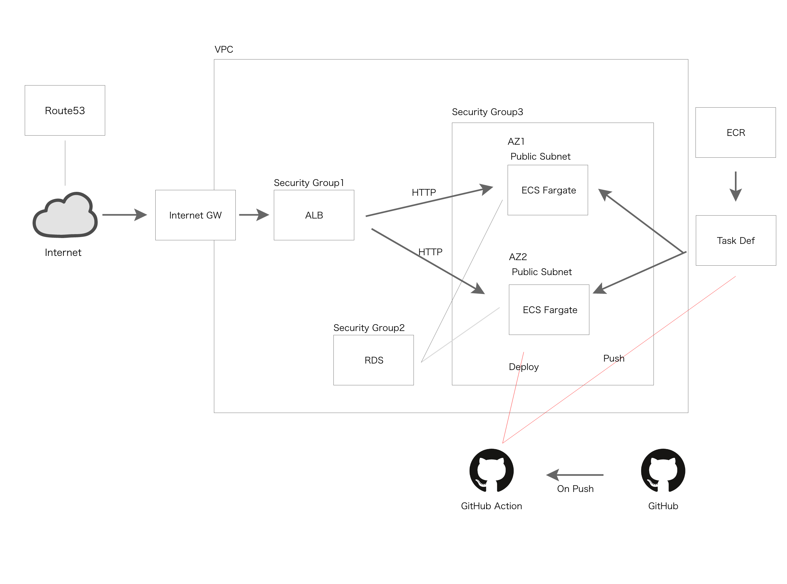

# Hacking to the YouTube API

[NuxtとGoではじめるWebアプリ開発](https://www.amazon.co.jp/Nuxt%E3%81%A8Go%E3%81%A7%E3%81%AF%E3%81%98%E3%82%81%E3%82%8BWeb%E3%82%A2%E3%83%97%E3%83%AA%E9%96%8B%E7%99%BA-%E6%8A%80%E8%A1%93%E3%81%AE%E6%B3%89%E3%82%B7%E3%83%AA%E3%83%BC%E3%82%BA%EF%BC%88NextPublishing%EF%BC%89-%E5%AF%BA%E7%94%B0-%E6%99%83%E5%A4%A7-ebook/dp/B0823H9Z5L) のサンプルアプリをベースに、  
go言語によるバックエンドの開発を模擬することを目的にしたRepoです。


## Env

node: v16.15.0
nuxt: v2.9.1
echo: v3.3.10


## Start

### Frontend
``` bash
cd nuxt
nvm use v16.15.0
npm run dev

```

### ServerSide
``` bash
cd go
air
```

### DB
``` bash
docker-compose up -d
cd go
go run ./tools/migrate.go
```

## Infra構成図

TODO: 以下、ポンチ絵のため時間があったら正しく書き直す


## Refs

* [NuxtとGoではじめるWebアプリ開発](https://www.amazon.co.jp/Nuxt%E3%81%A8Go%E3%81%A7%E3%81%AF%E3%81%98%E3%82%81%E3%82%8BWeb%E3%82%A2%E3%83%97%E3%83%AA%E9%96%8B%E7%99%BA-%E6%8A%80%E8%A1%93%E3%81%AE%E6%B3%89%E3%82%B7%E3%83%AA%E3%83%BC%E3%82%BA%EF%BC%88NextPublishing%EF%BC%89-%E5%AF%BA%E7%94%B0-%E6%99%83%E5%A4%A7-ebook/dp/B0823H9Z5L)